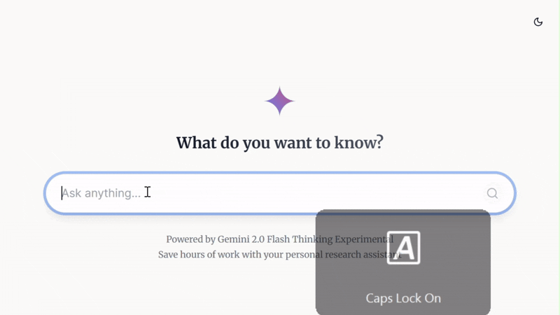

# Gemini Search

A Perplexity-style search engine powered by Google's Gemini 2.0 Flash model with grounding through Google Search. Get AI-powered answers to your questions with real-time web sources and citations.





## Features

- 🔍 Real-time web search integration
- 🤖 Powered by Google's latest Gemini 2.0 Flash model
- 📚 Source citations and references for answers
- 💬 Follow-up questions in the same chat session
- 🎨 Clean, modern UI inspired by Perplexity
- ⚡ Fast response times

## Tech Stack

- Frontend: React + Vite + TypeScript + Tailwind CSS
- Backend: Express.js + TypeScript
- AI: Google Gemini 2.0 Flash API
- Search: Google Search API integration

## Setup

### Prerequisites

- Node.js (v18 or higher recommended)
- npm or yarn
- A Google API key with access to Gemini API

### Installation

1. Clone the repository:

   ```bash
   git clone https://github.com/ammaarreshi/Gemini-Search.git
   cd Gemini-Search
   ```

2. Install dependencies:

   ```bash
   npm install
   ```

3. Create a `.env` file in the root directory:

   ```
   GOOGLE_API_KEY=your_api_key_here
   ```

4. Start the development server:

   ```bash
   npm run dev
   ```

5. Open your browser and navigate to:
   ```
   http://localhost:3000
   ```

## Environment Variables

- `GOOGLE_API_KEY`: Your Google API key with access to Gemini API
- `NODE_ENV`: Set to "development" by default, use "production" for production builds

## Development

- `npm run dev`: Start the development server
- `npm run build`: Build for production
- `npm run start`: Run the production server
- `npm run check`: Run TypeScript type checking

## Security Notes

- Never commit your `.env` file or expose your API keys
- The `.gitignore` file is configured to exclude sensitive files
- If you fork this repository, make sure to use your own API keys

## License

MIT License - feel free to use this code for your own projects!

## Acknowledgments

- Inspired by [Perplexity](https://www.perplexity.ai/)
- Built with [Google's Gemini API](https://ai.google.dev/)
- UI components from [shadcn/ui](https://ui.shadcn.com/)
